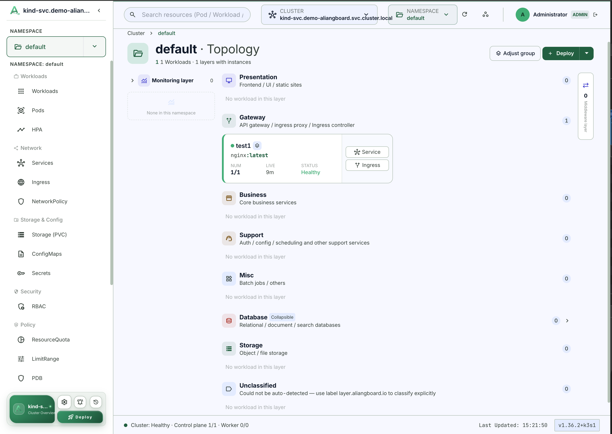
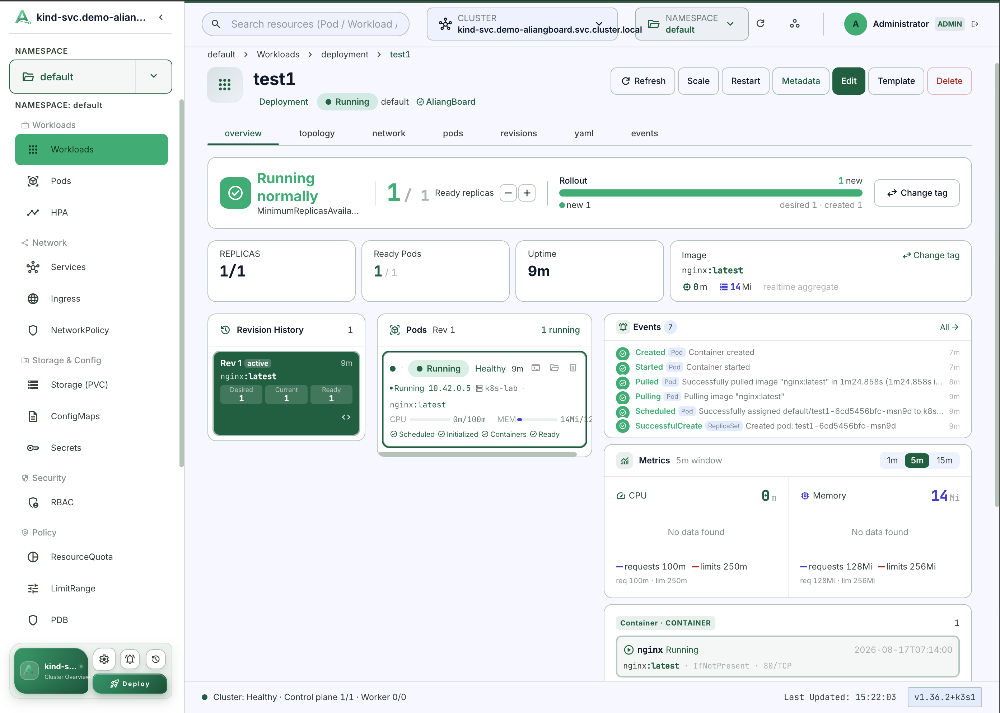

**English** | [简体中文](README.zh-CN.md)

# AliangBoard

[](https://github.com/aliang-one/aliangboard/actions/workflows/docker.yml)
[](https://github.com/aliang-one/aliangboard/pkgs/container/aliangboard)
[](https://nodejs.org)
[](https://vuejs.org)
[](./LICENSE)
[](https://demo-aliangboard.aliang.one/)

> Open-source, AI-native Kubernetes management panel — natural-language
> operations on top of full multi-cluster management.

AliangBoard turns an LLM into an operator for your clusters: with the built-in **Agent workbench** and **MCP server**, you can ask in natural language to read pod logs, debug containers, roll back a release, or modify resources. At the same time it is a complete Kubernetes panel covering the full resource lifecycle, exec / port-forward / debug-container injection, and multi-cluster switching.

Tech stack in one line: a Vue 3 + Vite + Pinia frontend (plain JS, no TypeScript) and a Node transparent Kubernetes API gateway (zero extra runtime dependencies).

## 🌐 Live Demo

| Item | Value |
| --- | --- |
| **Demo site** | [🚀 Open the live demo](https://demo-aliangboard.aliang.one/) |
| **Username** | `admin` |
| **Password** | `admin123` |

> The demo is a public, shared instance: anything you create or change is visible to other visitors, so please do not put anything sensitive on it.

## 📸 Screenshots

**Namespace Overview** — layered topology of a namespace (monitoring / business / database / storage layers) with health at a glance:



**Workload Overview** — a single workload at a glance: replicas, ready pods, image, events, CPU / memory and containers:



## ✨ Features

### 🤖 AI Operations

- Agent workbench + MCP server (Streamable HTTP, API-key auth)
- Tiered tools: read (free) / operator / admin (human-approved); writes are always human-approved
- Full audit log (who / verb / resource / HTTP code)
- Park a chat in the background and reopen it anytime from the floating entry point

### 🔌 Cluster & Multi-Cluster

- Bearer Token / Basic Auth connection validation, session restore, logout
- Connected clusters are persisted; one-click switch or remove

### 🗂 Full Resource Lifecycle

- 30+ resource types synced; structured creation forms (20 built-in kinds) persisted via Server-Side Apply
- YAML editing / export; optimistic delete with rollback on failure; apply multi-document YAML in one shot
- Resource coverage table (see below)

| Category | Resources |
|---|---|
| Core Workloads | Pod · Deployment · StatefulSet · DaemonSet |
| Networking | Service · Ingress · Endpoints · NetworkPolicy · IngressClass |
| Config & Storage | ConfigMap · Secret · PVC · PV · StorageClass |
| RBAC | Role · ClusterRole · RoleBinding · ClusterRoleBinding · ServiceAccount |
| Cluster & Policy | Namespace · Node · Event · RuntimeClass · PriorityClass · ResourceQuota · LimitRange · PDB |
| Autoscaling | HPA |
| Extensions | CRD + custom resources (API-discovery driven) |

### 🖥 Pod Deep Operations

- exec terminal (xterm.js, **tmux-backed: survives a page refresh**)
- attach · port-forward (Service / Deployment resolved to backend pods via endpoints)
- File browsing (upload / download with progress) · kubectl debug injection (ephemeral containers)

### 🔁 Rollout & Node Ops

- scale · rolling restart · rollout undo · CronJob manual trigger
- Node cordon / uncordon / drain (policy/v1 Eviction)

### 🔍 Navigation & Insights

- Global search across resources and namespaces · ownerReferences ownership topology with clickable jumps
- Events live watch + involvedObject filtering
- Namespace application layers (presentation / gateway / microservices / middleware / persistence, heuristic by default, exact via label `layer.aliangboard.io`)
- Metrics charts (CPU / memory sampling, 15-min persisted window)

## 🚀 Quick Start

### Kubernetes (recommended)

One command installs into the `aliangboard` namespace (NodePort exposure, 1Gi PVC dynamically provisioned by the default StorageClass):

```bash
kubectl apply -f https://raw.githubusercontent.com/aliang-one/aliangboard/main/deployment.yaml
kubectl -n aliangboard get svc aliangboard   # read the NodePort from the PORT(S) column, e.g. 8787:31234/TCP
```

Open `http://<any-node-IP>:<NodePort>` in your browser.

- Default administrator `admin` / `admin` — seeded via `ADMIN_USERNAME` / `ADMIN_PASSWORD` on first start only (changing the env after seeding has no effect); set strong credentials before applying in production
- Panel data (API keys, cluster credentials, audit log, workbench repository) persists in the `aliangboard-data` PVC; the SQLite store is single-replica — do not scale `replicas`
- When running inside a Kubernetes cluster, use `https://kubernetes.default.svc` as the API address, but the default ServiceAccount has no RBAC (you will get 403): create your own ServiceAccount with the required RBAC, obtain a token with `kubectl create token`, and supply the cluster CA certificate (or skip verification with the insecure option, development only)
- Uninstalling removes all data: `kubectl delete ns aliangboard` (namespace deletion cascades to the PVC)

### Docker

Images are published on GHCR:

```bash
docker pull ghcr.io/aliang-one/aliangboard:latest
docker run -d --name aliangboard \
  -p 8787:8787 \
  -v aliangboard-data:/app/data \
  ghcr.io/aliang-one/aliangboard:latest
```

Or build locally:

```bash
docker build -t aliangboard .
docker run -d --name aliangboard -p 8787:8787 -v aliangboard-data:/app/data aliangboard
```

Open `http://localhost:8787` in your browser. The SQLite database and the workbench git repository persist in the `aliangboard-data` volume — **it contains credentials, keep it safe**.

### From source

Requires Node.js 25+ (the server uses the built-in `node:sqlite` module, which is flag-free from Node 25; on 22–24 it is experimental and needs `--experimental-sqlite`). You also need network access to the target Kubernetes API server and a token or account with the required RBAC permissions.

```bash
git clone https://github.com/aliang-one/aliangboard.git aliangboard && cd aliangboard
npm install
npm run server   # terminal 1: API gateway
npm run dev      # terminal 2: frontend dev server (Vite proxies /api → 127.0.0.1:8787)
```

Production build: `npm run build` (output in `dist/`, served same-origin by the gateway's `server/static.mjs`).

## 🤖 AI Workbench & MCP

AliangBoard turns an LLM into a cluster operator via two paths.

### Built-in Agent Workbench

Chat with your cluster directly in the admin console ("Agent Console"). The agent calls a set of Kubernetes tools through a bound ServiceAccount:

- **Read (no approval)**: pod logs · list / get resources and YAML · events · `can-i` RBAC self-check · rollout history
- **Operator (human approval)**: scale (1..20, no scaling to 0) · rolling restart
- **Admin (human approval)**: exec commands · read / browse container files · apply / delete resources · update image · kubectl debug injection · rollback to a specific revision

**Every write goes through a human-approval checkpoint** — the agent proposes, you confirm, nothing changes your cluster silently.

### MCP Server (external AI clients)

AliangBoard is also an **MCP server** (`POST /mcp`, Streamable HTTP, API-key auth) that exposes the same toolset to external AI clients such as Claude Code:

```bash
claude mcp add --transport http aliangboard {HOST}/mcp \
  --header "Authorization: Bearer <YOUR_API_KEY>"
```

Remove it with: `claude mcp remove aliangboard`

### Bring Your Own LLM

The agent speaks the **OpenAI-compatible protocol**. Set `baseURL` + `apiKey` + `model` in the admin console ("LLM Settings"), or set the environment variables `LLM_BASE_URL` / `LLM_MODEL`. OpenAI, DeepSeek, Qwen, GLM, and local vLLM / Ollama (with an OpenAI-compatible endpoint) all work.

### Security Model

- Every API key is **bound to one ServiceAccount**; tool calls are constrained by that SA's Kubernetes RBAC
- Tools are tiered **read / operator / admin**; `minTier` filters the tools available to each key
- Writes and workbench file writes **always require human approval**
- Every call is recorded in the **audit log** (who / verb / resource / HTTP code)

## ⚙️ Configuration

Backend environment variables:

| Variable | Default | Description |
| --- | --- | --- |
| `HOST` | `127.0.0.1` | API gateway listen address |
| `PORT` | `8787` | API gateway listen port |
| `CORS_ORIGIN` | `*` | Allowed frontend origins; set to your actual domain in production |
| `SESSION_TTL_MS` | `28800000` | In-memory session lifetime, 8 hours by default |
| `MAX_PLATFORM_SESSIONS_PER_USER` | `10` | Max platform sessions kept per user; the least recently active one is evicted on login when exceeded, disabled when < 1 |
| `K8S_REQUEST_TIMEOUT` | `15000` | Kubernetes API request timeout, in milliseconds |
| `K8S_ALLOWED_HOSTS` | empty | Comma-separated allowlist of API server hosts |
| `K8S_INSECURE_SKIP_TLS_VERIFY` | `false` | Skip cluster certificate verification **for K8s sessions only**; does not disable process-level TLS (LLM/version checks unaffected). Use only in development with self-signed clusters |
| `PORT_FORWARD_HOST` | `127.0.0.1` | Port-forward local listen address (same as kubectl port-forward; local to the gateway host, the browser must be able to reach it) |
| `LLM_BASE_URL` | empty | OpenAI-compatible baseURL for the LLM (can also be set in the admin console "LLM Settings") |
| `LLM_MODEL` | empty | LLM model name (can also be set in the admin console) |

Frontend environment variables:

| Variable | Default | Description |
| --- | --- | --- |
| `VITE_API_BASE_URL` | empty | Full address of the API gateway; keep empty for same-origin deployments |
| `ALIANGBOARD_API_URL` | `http://127.0.0.1:8787` | Vite dev proxy target |

To connect to a cluster with a self-signed certificate during development, you can temporarily run:

```bash
K8S_INSECURE_SKIP_TLS_VERIFY=true npm run server
```

**Note:** This variable only affects K8s session verification (TLS to the cluster API server). It does not disable process-level TLS verification for LLM calls or version checks. Use only in development/self-signed environments.

## 🔒 Production Deployment Security Requirements

### TLS Termination

**Production deployments MUST terminate TLS at an edge layer** (reverse proxy or Ingress Controller). The default NodePort exposure in `deployment.yaml` is intended for internal network evaluation only.

- **Ingress (recommended):** See `deploy/ingress-tls.yaml` for a complete nginx Ingress + TLS example
  - TLS is terminated at the Ingress layer
  - Backend Service remains plain HTTP (containerPort: 8787)
  - Supports cert-manager automation or manual TLS secrets
- **Alternative reverse proxy:** Configure nginx/HAProxy/Envoy with TLS termination, proxying to the NodePort or Service

### K8s Session TLS

The `K8S_INSECURE_SKIP_TLS_VERIFY` environment variable has **session-scoped semantics**:

- **Purpose:** Only controls TLS verification for K8s cluster connections (session-level)
- **Does NOT affect:** Process-level TLS (LLM API calls, version checks, etc.)
- **Use case:** Development/self-signed clusters only
- **Production:** Configure a trusted CA and `K8S_ALLOWED_HOSTS` instead

Do not skip TLS verification in production without proper security review.

## 🔐 RBAC Recommendations

Do not use long-lived `cluster-admin` tokens. Create a dedicated ServiceAccount and grant only what your usage actually needs:

- `get`, `list`, `watch` on resources
- `create`, `update`, `patch`, `delete` on the resources you need to edit
- `get` on pod logs
- `create` on pod eviction
- `patch` for node operations
- `pods/exec` (`create`) for the exec terminal
- `pods/portforward` (`get` / `create`) for port forwarding
- `pods/ephemeralcontainers` (`update`) for debug container injection
- `pods/attach` (`create`) for pod attach
- `jobs` (`create`) for CronJob manual trigger

The API gateway keeps cluster credentials and sessions in memory by default, so all login sessions are lost on restart (with container deployment, credentials persist in the `/app/data` volume). For multi-instance production deployments, move sessions and encrypted cluster credentials to dedicated storage.

## 🐳 Container Deployment & Release

The repository ships a multi-stage `Dockerfile`: a single Node process serves both the frontend static files and the API gateway, ready to run out of the box.

Container variables (they override the backend variables of the same name):

| Variable | Default | Description |
| --- | --- | --- |
| `HOST` | `0.0.0.0` | Listen address inside the container (set by the image; do not change it back to 127.0.0.1) |
| `PORT` | `8787` | Listen port |
| `ALIANG_DB` | `/app/data/aliangboard.db` | SQLite database path (inside the volume) |
| `ALIANG_WORKBENCH_DIR` | `/app/data/workbench` | Workbench git repository directory (inside the volume) |
| `ALIANG_STATIC_DIR` | `/app/dist` | Frontend static directory (rarely needs changing) |

> The runtime image is based on `node:25-alpine` (hard requirement for `node:sqlite`) with `git` built in (needed for the workbench repository). It runs as the non-root user `node`.

### Release & CI

- Builds are triggered **only** by pushing a `v*` tag (e.g. `v1.2.3`) or by a manual `workflow_dispatch` from the Actions page. Regular pushes do not build images.
- Published image tags on GHCR:
  - `ghcr.io/aliang-one/aliangboard:latest` — follows the newest release
  - `ghcr.io/aliang-one/aliangboard:1.2.3` — immutable semver pin, for exact version lock
  - `ghcr.io/aliang-one/aliangboard:1.2` — rolls with each minor release
- Multi-platform `linux/amd64` + `linux/arm64`; authentication uses the built-in `GITHUB_TOKEN`, no extra secrets required
- Historical images can be pruned via the manual cleanup workflow (`.github/workflows/cleanup-ghcr.yml`, dry-run by default)
- Current release: `v1.0.3`

## 🖥 SSH Server Management

Manage SSH servers alongside Kubernetes clusters — credentials stored AES-256-GCM encrypted (key file kept separate from the database).

- **Server inventory**: host/port/credentials (password or private key + sudo password), optional cluster association and tags; connection test detects the distro (Ubuntu/Debian/Arch/Alpine/Rocky…) and shows its icon plus a health badge.
- **Workbench terminals**: interactive floating terminals with gateway-side keepalive — refreshing the page replays scrollback and resumes the same shell.
- **SFTP**: browse/upload/download with progress.
- **AI access (opt-in per server)**: each server has an "expose to AI" toggle with an approval policy (`always` = every command human-approved, `readonly` = read-only commands auto-allowed, `none` = unrestricted). Exposed servers appear in the AI ledger (`read_server_ledger`) where the agent records each server's role/deployments (`write_server_notes`, human-approved).

**Authorization model (deliberately simple, open-source edition)**:

- Server CRUD, credentials and the ledger are **admin-only**; terminals, SFTP and AI access are **admin-only as well**.
- API keys can be granted SSH access with a single boolean (`SSH server access` when creating/editing a key). Granted keys reach MCP tools `wb_ssh_exec` / `wb_ssh_read_file` / `read_server_ledger` for servers that are exposed to AI; each server's approval policy applies in a fail-closed way (`always` denies exec on the key channel since no human approver exists there). No grouping or per-user permission management.

## ⚠️ Known Limitations

- The exec terminal, port forwarding, and file browsing only work when a real cluster is connected; without one, the related entry points show an empty state.
- Port forwarding opens a local TCP listener on the gateway host (default `127.0.0.1`, same as kubectl port-forward). When the panel runs on a remote host, the browser cannot reach that port directly — use an SSH tunnel or similar.
- The exec terminal runs `/bin/sh` by default (adjustable via the component's `command` prop); for shell-less images such as distroless, use kubectl debug to inject an ephemeral container with a shell (requires Kubernetes 1.25+; EphemeralContainers is enabled by default).
- Multi-cluster switching reuses the gateway session; sessions are lost when the gateway restarts, so saved clusters must be logged into again. Session credentials live only in the browser's localStorage — do not use them on shared devices.
- The "Audit" page shows cluster Events as the activity record; full user-level auditing (who / verb / IP / HTTP code) requires cluster audit logging wired to a log backend — the standard Kubernetes API does not provide it.
- Helm, GitOps, and alerting are not integrated yet.
- HPA / PDB depend on specific API versions (e.g. autoscaling/v2, policy/v1); on older clusters the corresponding creation fails with a toast message.
- When deployed inside a Kubernetes cluster, the port-forward listener opens in the panel Pod's network namespace and the browser cannot reach it directly; this capability targets Docker / source deployments and is unavailable for in-cluster installs (a gateway-side proxy may come later).

## 🛠 Tech Stack

**Frontend** — Vue 3 · Vite · Pinia · Vue Router · @tanstack/vue-query · vue-i18n · xterm.js · marked · DOMPurify (plain JS, no TypeScript)

**Backend** — Node.js 25 (built-in `node:sqlite`) · @kubernetes/client-node · transparent Kubernetes API gateway with zero extra runtime dependencies

**Testing** — server and pure-logic tests on an in-house zero-dependency runner + `node --test`; frontend unit tests with vitest + @vue/test-utils + happy-dom

**Packaging** — a single multi-stage Docker image (`node:25-alpine`), one process serving API + SPA same-origin

## 🤝 Contributing

Issues and PRs are welcome. Local development:

```bash
npm install
npm run server     # API gateway
npm run dev        # frontend
npm test           # server + pure-logic tests
npm run test:unit  # frontend unit tests (vitest)
npm run typecheck  # node --check syntax baseline
```

**Bilingual sync rule:** any change to `README.md` must update `README.zh-CN.md` in the same PR.

## License

[Apache License 2.0](./LICENSE). Commercial use, modification, distribution, and private use are permitted, provided the copyright and license notices are retained.
